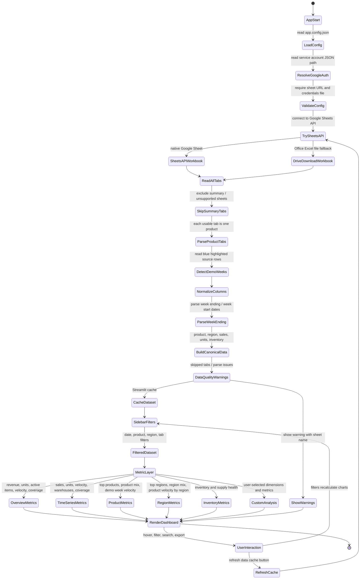
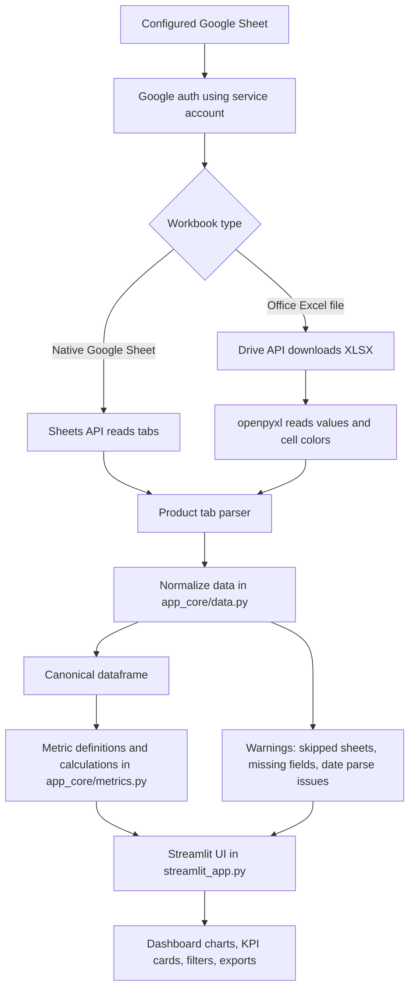

# Costco Dashboard System Flow

This dashboard is a local Streamlit application that reads one configured Google Sheet, parses each product tab, normalizes the data, calculates metrics, and renders the dashboard.

## State Machine View

## Layered Flow

## Main Responsibilities

- `app.config.json`: stores the Google Sheet URL and service account path.
- `app_core/google_sheets.py`: connects to Google, downloads/reads all tabs, and detects demo week blue highlighting.
- `app_core/data.py`: converts raw Google workbook tabs into a single normalized dataframe.
- `app_core/metrics.py`: source of truth for metric definitions and reusable metric calculations.
- `streamlit_app.py`: renders filters, KPI cards, charts, warnings, tables, and exports.
- `setup_and_run.sh`: creates/uses the Python environment, installs requirements, and starts Streamlit.

## Important Behavior

- Google Sheets is the only supported dashboard data source.
- Filters apply globally to the dashboard.
- Google Sheets are read-only from the dashboard; the app does not write back to the source sheet.
- Demo weeks are detected from existing blue-highlighted rows in the workbook and highlighted inside dashboard charts.
- Skipped sheets or parsing issues appear as dashboard warnings with the relevant sheet name.
- Adding new charts should generally mean adding metric logic in `app_core/metrics.py`, then rendering it in `streamlit_app.py`.
